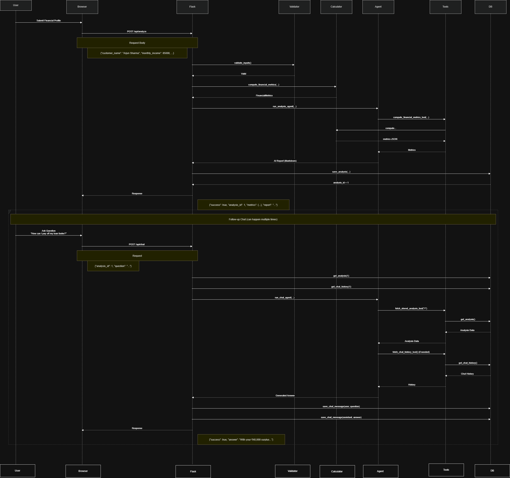

# 🏦 AI Personal Banking Financial Advisor

Personal financial management can be difficult for individuals due to challenges in tracking income and expenses, understanding loan commitments, evaluating savings potential, and making informed financial decisions. This project addresses these challenges by developing an AI-powered Banking Financial Advisor that analyzes user-provided financial data such as monthly income, expenses, existing loan EMIs, savings, and financial goals to calculate key financial metrics including EMI ratio, savings rate, monthly surplus, projected annual savings, and credit utilization. Based on these calculations, the system leverages Large Language Models (LLMs) to generate personalized financial insights, affordability assessments, risk evaluations, and actionable recommendations, enabling users to better understand their financial health and make smarter financial decisions.
---

## Architecture

```
┌─────────────────────────────────────────────────────────┐
│                     Browser (HTML/JS)                    │
│   Form Input → POST /api/analyze                        │
│   Chat Box   → POST /api/chat                           │
└───────────────────────┬─────────────────────────────────┘
                        │ HTTP
┌───────────────────────▼─────────────────────────────────┐
│              Flask Application  (run.py)                 │
│                                                          │
│  ┌─────────────────────────────────────────────────┐    │
│  │           api/routes.py  (Blueprint)             │    │
│  │  POST /api/analyze   POST /api/chat              │    │
│  │  GET  /api/history   GET  /api/analysis/<id>     │    │
│  └──────────┬──────────────────┬───────────────────┘    │
│             │ validate          │ validate               │
│  ┌──────────▼──────────┐       │                        │
│  │ financial_calculator│       │                        │
│  │ (pure Python, no LLM│       │                        │
│  │  emi_ratio          │       │                        │
│  │  savings_rate       │       │                        │
│  │  credit_utilization │       │                        │
│  │  projected_savings) │       │                        │
│  └──────────┬──────────┘       │                        │
│             │ metrics           │                        │
│  ┌──────────▼──────────────────▼───────────────────┐    │
│  │           services/agent.py                      │    │
│  │   LangChain AgentExecutor                        │    │
│  │   ┌────────────────────────────────────────┐    │    │
│  │   │  System Prompt + User Input            │    │    │
│  │   │  → LLM decides which tools to call     │    │    │
│  │   │  → compute_financial_metrics_tool      │    │    │
│  │   │  → fetch_stored_analysis_tool          │    │    │
│  │   │  → fetch_chat_history_tool             │    │    │
│  │   │  → interprets results → Report/Answer  │    │    │
│  │   └────────────────────────────────────────┘    │    │
│  └──────────┬───────────────────────────────────────┘    │
│             │                                            │
│  ┌──────────▼──────────────────────────────────────┐    │
│  │           db/database.py  (SQLite)               │    │
│  │   TABLE analysis      TABLE chat_history         │    │
│  └─────────────────────────────────────────────────┘    │
└─────────────────────────────────────────────────────────┘
```

**Key design principle:** The LLM *never* does maths. It calls `compute_financial_metrics_tool`, receives the deterministic Python output, then interprets the numbers into a human financial report.

---

## Project Structure

```
banking-advisor/
├── run.py                          # Entry point
├── pyproject.toml
├── .env.example                    # Copy to .env and fill in keys
├── templates/
│   └── index.html                  # Single-page UI
├── app/
│   ├── __init__.py                 # Flask factory + DB init
│   ├── api/
│   │   └── routes.py               # /api/analyze, /api/chat, etc.
│   ├── services/
│   │   ├── financial_calculator.py # Pure Python calculations
│   │   ├── llm_factory.py          # OpenAI / Gemini / Ollama selector
│   │   └── agent.py                # LangChain AgentExecutor
│   ├── tools/
│   │   └── financial_tools.py      # LangChain @tool definitions
│   └── db/
│       └── database.py             # SQLite CRUD
```

---

## Setup

### 1. Clone & Install

```bash
git clone <repo>
cd banking-advisor
uv venv
source venv/bin/activate   # Windows: venv\Scripts\activate
uv sync #check needed packages are stored in pyproject.toml
```

### 2. Configure

```bash
cp .env
# Edit .env — choose your LLM_PROVIDER and add the API key
```

**OpenAI (recommended)**
```env
LLM_PROVIDER=openai
OPENAI_API_KEY=sk-...
OPENAI_MODEL=gpt-4o-mini
```

**Google Gemini**
```env
LLM_PROVIDER=gemini
GOOGLE_API_KEY=AIza...
GEMINI_MODEL=gemini-1.5-flash
```

**Ollama (local, free)**
```env
LLM_PROVIDER=ollama
OLLAMA_BASE_URL=http://localhost:11434
OLLAMA_MODEL=llama3
```

### 3. Run

```bash
uv run python run.py 
# → http://localhost:5000/
```

---
### Financial Calculations Reference pdf


## API Reference

### `POST /api/analyze`

**Request body**
```json
{
  "customer_name":     "Arjun Sharma",
  "monthly_income":    85000,
  "monthly_expense":   45000,
  "existing_loan_emi": 12000,
  "credit_card_limit": 200000,
  "credit_card_used":  60000,
  "savings_goal":      500000
}
```

**Response**
```json
{
  "success": true,
  "analysis_id": 1,
  "metrics": {
    "emi_ratio": 14.12,
    "savings_rate": 47.06,
    "credit_utilization": 30.0,
    "projected_annual_savings": 480000,
    "monthly_surplus": 40000,
    "is_deficit": false
  },
  "report": "### 🏦 Financial Health Assessment\n..."
}
```

---

### `POST /api/chat`

**Request body**
```json
{
  "analysis_id": 1,
  "question": "How can I pay off my loan faster?"
}
```

**Response**
```json
{
  "success": true,
  "answer": "Given your ₹40,000 monthly surplus and an EMI ratio of only 14%..."
}
```

---

### `GET /api/history`

Returns a paginated summary of all past analyses.

### `GET /api/analysis/<id>`

Returns the full analysis record plus complete chat history for that session.

---
### Sequence Diagram

## Financial Calculations

All maths is performed in `services/financial_calculator.py` — zero LLM involvement:

| Metric | Formula |
|--------|---------|
| EMI Ratio | `existing_loan_emi / monthly_income × 100` |
| Savings Rate | `(monthly_income - monthly_expense) / monthly_income × 100` |
| Credit Utilization | `credit_card_used / credit_card_limit × 100` |
| Projected Annual Savings | `(monthly_income - monthly_expense) × 12` |

---

## Interpretation Thresholds (used by the agent)

| Metric | Good | Caution | Critical |
|--------|------|---------|----------|
| EMI Ratio | < 30% | 30–50% | > 50% |
| Savings Rate | > 20% | 10–20% | < 10% |
| Credit Utilization | < 30% | 30–60% | > 60% |

---

## Database Schema

```sql
CREATE TABLE analysis (
    id                      INTEGER PRIMARY KEY AUTOINCREMENT,
    customer_name           TEXT,
    monthly_income          REAL,
    monthly_expense         REAL,
    existing_loan_emi       REAL,
    credit_card_limit       REAL,
    credit_card_used        REAL,
    savings_goal            REAL,
    emi_ratio               REAL,
    savings_rate            REAL,
    credit_utilization      REAL,
    projected_annual_savings REAL,
    ai_report               TEXT,
    created_at              TEXT
);

CREATE TABLE chat_history (
    id          INTEGER PRIMARY KEY AUTOINCREMENT,
    analysis_id INTEGER REFERENCES analysis(id),
    role        TEXT CHECK(role IN ('user','assistant')),
    content     TEXT,
    created_at  TEXT
);
```
